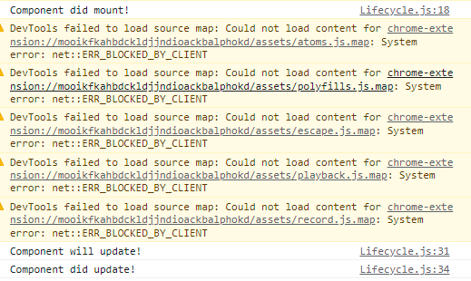

# Component Lifecycle

## Component Lifecycle là gì ?

- Chúng ta có thể thấy được mọi thứ trong thế giới hiện nay đều hoạt động theo một chu kì. Các Component của React cũng vậy, đều có chu kỳ riêng, components được khởi tạo (hiển thị ra DOM), update, và kết thúc (unmount),..đó được gọi là một component life cycle.

- React cho phép chúng ta tham gia vào các giai đoạn của mỗi component bằng cách sử dụng các phương thức được xây dựng sẵn trong mỗi giai đoạn đó. Khi một components được khởi chạy nó sẽ phải trải qua 4 giai đoạn chính:

1. Initialization
2. Mounting
3. Updating
4. Unmounting

### Giai đoạn Initialization

- Đây là giai đoạn mà thành phần sẽ bắt đầu hành trình của mình bằng cách khởi tạo state và props. Điều này thường được thực hiện bên trong phương thức constructor.

- Ở giai đoạn này, React Component sẽ tiến hành khởi tạo các state, props hay các câu lệnh được khởi tạo trong constructor(),...

### Giai đoạn Mounting

- Giai đoạn này được thực hiện sau khi quá trình initialization (khởi tạo) được hoàn thành. Nó thực hiện nhiệm vụ chuyển virtual DOM (DOM ảo) trong React thành DOM và hiển thị trên trình duyệt. Component sẽ được render lần đầu tiên, ở đây chúng ta có 3 phương thức để tham gia vào giai đoạn này.

  - componentWillMount()

- Được khởi chạy khi một component chuẩn bị được mount (tức là trước khi thực hiện render), sau khi thực hiện xong componentWillMount() thì component mới có thể được mount.

- Lưu ý: Chúng ta không nên thực hiện bất cứ thay đổi nào liên quan đến state, props hay call API ở trong hàm này, bởi thời gian chuẩn bị mount -> mount rất ngắn nên các tác vụ đó không thể hoàn thành kịp. Khiến cho component render ra kết quả không như bạn mong muốn.

  - componentDidMount()

- Được gọi khi component đã được mount (render thành công ), quá trình này xảy ra sau khi componentWillMount() thực hiện xong. Trong phương thức này bạn có thể gọi API, thay đổi state, props.

### Giai đoạn Updating

- Đây là giai đoạn thứ ba mà các component phải thực hiện, sau giai đoạn initialization (khởi tạo ) , mount (render lần đầu),... . Trong giai đoạn này, dữ liệu của các phần (props & state) sẽ được cập nhật để đáp ứng với các sự kiện của người dùng như click, gõ, v.v. Điều này dẫn đến việc re-render lại component, ở trong giai đoạn này chúng ta sẽ có 4 phương thức chính:

  - shouldComponentUpdate()

- Phương thức này xác định xem component có nên được render lại hay không ? Theo mặc định, nó trả về true. Nhưng bạn có thể thay đổi giá trị trả về của nó theo từng trường hợp. Nó sẽ nhận về 2 tham số truyền vào là nextState và nextProps.
  - componentWillUpdate()

- Phương thức này được gọi trước khi tiến hành re-render, bạn có thể thực hiện các hành động như update state, props,...trong phương thức này trước khi tiến hành re-render. Giống như shouldComponentUpdate(), componentWillUpdate() sẽ nhận vào 2 tham số đó là nextState và nextProps.

  - ComponentDidUpdate()
- Phương thức này được gọi khi component đã re-render xong.
- Ví dụ cho cả ba phương thức trên :

- Ở console :

### Giai đoạn Unmounting

- Đây là bước cuối cùng trong mỗi component, khi tất cả các tác vụ hoàn thành và bạn tiến hành unmount DOM. Quá trình này chỉ có duy nhất 1 phương thức đó là :  
  - componentWillUnmount()
- Đây là bước cuối cùng và sẽ kết thúc một vòng đời của components.

- Ta sử dụng componentWillUnmount() để gỡ component Clock khỏi DOM trong trường hợp ta không còn sử dụng Clock nữa.

- Ta sử dụng componentDidMount() để làm mới CLock lại sau mõi giây, nhờ vào việc thay đổi trạng thái của nó, từ đó làm đồng hồ chạy.

