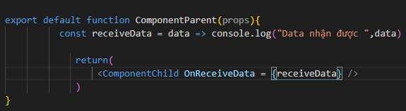
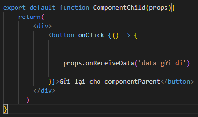
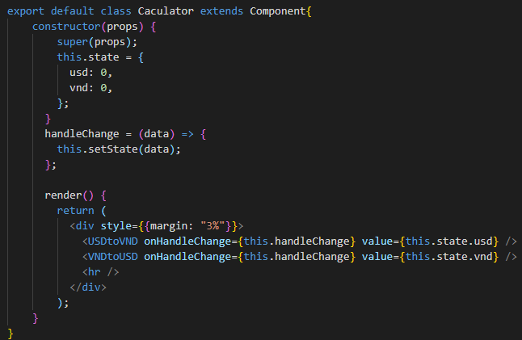
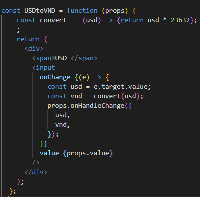
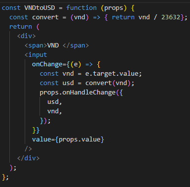
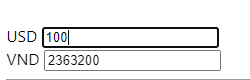

# Lifting State Up

## Kỹ thuật Lifting State Up là gì ?

- Trong quá trình làm việc với React, các component phải re-render và thay đổi rất nhiều lần. Trong một vài trường hợp, bạn muốn khi 1 component con được thay đổi, đồng thời bạn muốn component cha cũng sẽ bắt được hành động đó. Thì kỹ thuật để làm điều này trong ReactJs được gọi là kỹ thuật Lifting State Up.

- Kỹ thuật này cung cấp cho chúng ta cách để có thể chia sẻ các state của component con cho các componets cha của nó để các components có thể thay đổi cùng lúc với nhau.

- Trước tiên, chúng ta sẽ truyền cho ComponentChild một props có giá trị là một function. Function này sẽ được gọi khi component con trả về dữ liệu :

- Tiếp theo, ở ComponentChild chúng ta sẽ tiến hành gửi lại cho ComponentParent bằng cách truyền vào props onReceiveData giá trị cần gửi về.

- Vậy là chúng ta đã gửi thành công dữ liệu từ ComponentChild sang ComponentParent. Lúc này ComponentParent có thể sử dụng dữ liệu đó.

- Tién hành áp dụng kỹ thuật này để tạo một Caculator quy đỔi tiền đơn giản như sau :

- Trước tiên, chúng ta sẽ đi xây dựng Component cha có tên Caculator, và hàm handleChange chịu trách nhận data từ Component con.

- Ta sẽ truyền cho 2 Component con có tên USDtoVND và VNDtoUSD các props như sau:

  - onHandleChange : giúp cho Component con có thể gửi dữ liệu về Component cha.
  - value : giá trị của input.

- Tiếp theo, chúng ta sẽ khởi tạo các Component con có tên USDtoVND và VNDtoUSD :

- Các Component này có nhiệm vụ chuyển từ đổi tiền và trả về cho Component cha bằng prop onHandleChange().

- Và cuối cùng khi ta thực hiện chương trình ta sẽ thấy sự thay đổi cùng lúc khi ta nhập dữ liệu vào 1 trong hai feild input trên.

