# Props and State

## Props là gì ?

- Props là một từ viết tắt của Properties dùng để diễn tả các thuộc tính của một Component trong React.
- Props là một object được truyền vào trong một components, mỗi components sẽ nhận vào props và trả về react element.
- Props cho phép chúng ta giao tiếp giữa các components với nhau bằng cách truyền tham số qua lại giữa các components.

- Ví dụ : Ta có một Component là Welcomes
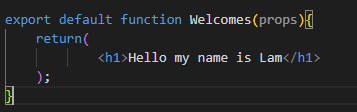
- Ở đây ta trả về một nội dung được gán cứng bên trong Component là tag h1, điều này khá là bất tiện trong việc tái sử dụng lại Component trong trường hợp ta muốn gửi lời chào đến một người khác thì ra phải thay đổi lại nội dung bên trong tag h1. Do đó ta có thể truyền dữ liệu đến Component bằng cách dùng Props
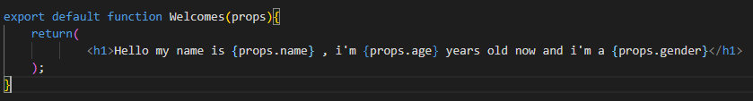

- Nơi truyền dữ liệu vào Component :
 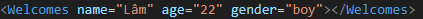
- Từ đó ta có thể tái sử dụng nhiều lần Component bằng cách truyền dữ liệu thông qua Props
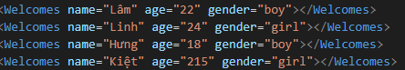
- Kết quả trên trình duyệt :
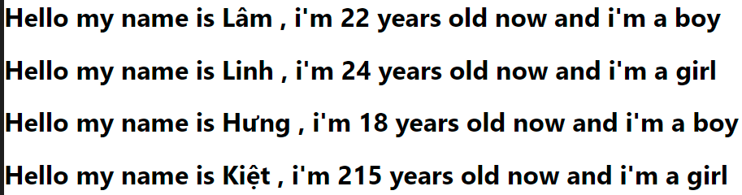
- Nhờ có Props ta có thể tái sử dụng lại Component nhiều lần cho các mục đÍch khác nhau
- Props là một Object :
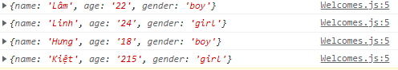

## State là gì ?

- State là một object có thể được sử dụng để chứa dữ liệu hoặc thông tin về components. State có thể được thay đổi bất cứ khi nào mong muốn. Khác với props bạn có thể truyền props sang các components khác nhau thì state chỉ tồn tại trong phạm vi của components chứa nó, mỗi khi state thay đổi thì components đó sẽ được render lại.

- Trong các dự án React, state được dùng để phản hồi các yêu cầu từ người dùng, hay lưu trữ một dữ liệu nào đó trong components

-Dưới đây là một class Components và ta sẽ tiến hành khởi tạo một state bên trong constructor :
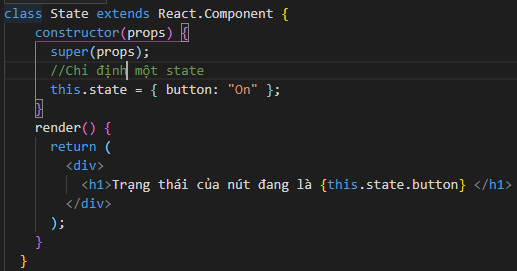

- Trong các components bạn cần phải thao tác với state rất nhiều , ngoài thêm và lấy giá trị của state bạn còn phải cập nhật các states để ReactJS có thể tự động re-render lại components. Điều này khá quan trọng, giả sử bạn đang cho người dùng nhập vào môt form nào đó và khi click Lưu thì nội dung được điền trong form lúc này sẽ phải hiển thị ra màn hình. Đây là lúc bạn cần dùng đến cách thay đổi giá trị của một state.
- Dưới đây là một ví dụ về việc thay đổi giá trị tăng hay giảm của một giá trị khi ta sử dụng State :
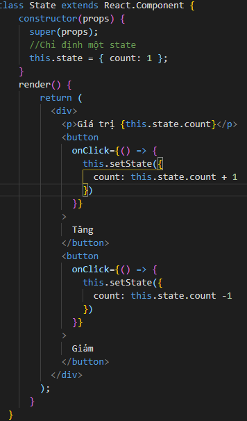
- Ta sử dung phương thức sau để thay đổi state tăng giảm khi bấm vào nút tương ứng :
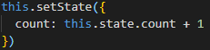
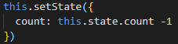

- Giá trị khi ta mới khởi tạo :
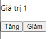
- Giá trị sau khi ta bấm nút tăng để thay đổi trạng thái tăng thêm 1 đơn vị :
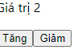

## Sự khác nhau giữa Props và State

- Dù luôn đi chung với nhau nhưng Props và State hoàn toàn khác biệt với nhau :

- State: Dữ liệu chỉ nằm trong phạm vi của một component. Nó được sở hữu bởi một components cụ thể mà chỉ là của component đó thôi.

- Props: Dữ liệu được truyền từ component cha cho componet con, components con khi nhận được sẽ chỉ được đọc mà không thể thay đổi dữ liệu đó.
