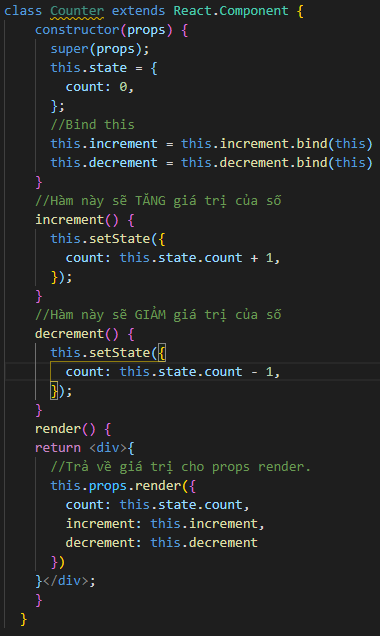
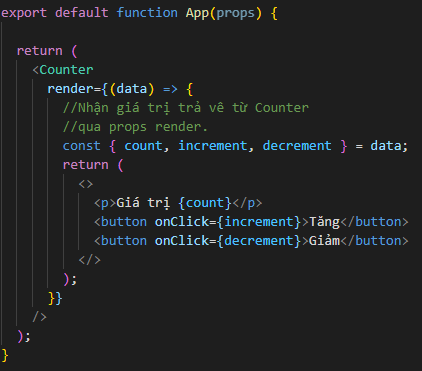
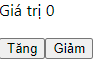

# Render Props

- Thuật ngữ Render Props được biết đến như là một kỹ thuật dũng để chia sẻ đoạn mã giữa các React Components bằng cách sử dụng prop có giá trị như một function.

- Một Component sử dụng render prop sẽ nhận một function mà giá trị trả về là một React Element và gọi chính nó thay vì phải sử dụng chính render logic của mình.

- Chúng ta sẽ đi vào một ví dụ để làm rõ hơn về Render Props :

- Trước tiên, chúng ta sẽ đi xây dựng một Component có tên Counter, có nhiệm vụ xây dựng hàm tăng, giảm và hiển thị số.

- Ở đây chúng ta sẽ trả về giá trị của số và hàm thực hiện tăng giảm số vào props có tên render.

- Tiếp theo, mình sẽ gọi component này ở bất cứ đâu, props có tên render được tryền vào sẽ có giá trị là một function và tham số của function đó sẽ là giá trị trả về.

- Cuối cùng ta sẽ có kết quả sau đây :

